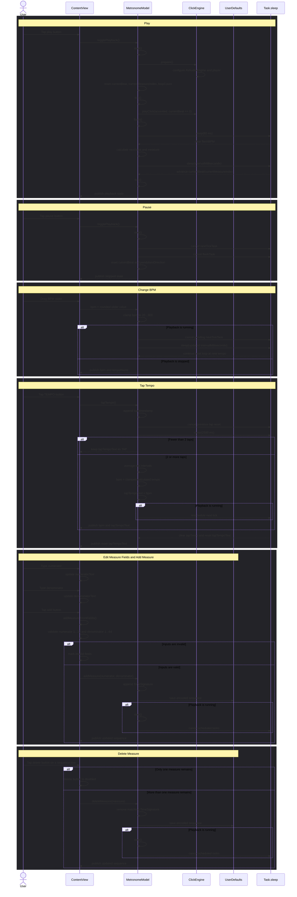

# User Action Sequence Diagram

```mermaid
sequenceDiagram
    actor User
    participant View as ContentView
    participant Model as MetronomeModel
    participant Engine as ClickEngine
    participant Defaults as UserDefaults
    participant Timer as Task.sleep

    rect rgb(35, 35, 40)
        Note over User,Timer: Play
        User->>View: Tap play button
        View->>Model: togglePlayback()
        Model->>Model: start()
        Model->>Engine: prepare()
        Engine->>Engine: configure AVAudioEngine and player
        Model->>Model: reset currentBeat, currentMeasureIndex, loopCount
        Model->>Model: tick()
        Model->>Engine: playClick(accented: currentBeat == 0)
        Model->>Model: flash()
        Model->>Timer: sleep(80 ms)
        Timer-->>Model: clear flashBPM
        Model->>Model: calculate next beat and measure
        Model->>Timer: sleep(intervalMilliseconds)
        Timer-->>Model: advance currentBeat/currentMeasureIndex
        Model->>Model: tick()
        Model-->>View: publish playback state
    end

    rect rgb(35, 35, 40)
        Note over User,Timer: Pause
        User->>View: Tap pause button
        View->>Model: togglePlayback()
        Model->>Model: stop()
        Model->>Timer: cancel nextTickTask
        Model->>Timer: cancel flashTask
        Model->>Model: reset currentBeat and pendulumDirection
        Model-->>View: publish stopped state
    end

    rect rgb(35, 35, 40)
        Note over User,Timer: Change BPM
        User->>View: Drag BPM slider
        View->>Model: bpm = rounded slider value
        Model->>Model: clamp bpm to 20...300
        alt Playback is running
            Model->>Timer: cancel pending nextTickTask
            Model->>Timer: sleep(updated intervalMilliseconds)
            Timer-->>Model: continue beat loop at new tempo
        else Playback is stopped
            Model-->>View: publish bpm and tempoName
        end
    end

    rect rgb(35, 35, 40)
        Note over User,Timer: Tap Tempo
        User->>View: Tap TEMPO button
        View->>Model: tapTempo()
        Model->>Model: append tap timestamp
        Model->>Timer: cancel previous tap reset
        Model->>Timer: sleep(2500 ms)
        alt Fewer than 2 taps
            Model-->>View: keep tapTempoText as TAP
        else 2 or more taps
            Model->>Model: average tap intervals
            Model->>Model: bpm = clamped calculated tempo
            Model->>Model: tapTempoText = bpm
            alt Playback is running
                Model->>Timer: reschedule next tick
            end
            Model-->>View: publish bpm and tapTempoText
        end
        Timer-->>Model: clear tapTimes and reset tapTempoText
        Model-->>View: publish reset tapTempoText
    end

    rect rgb(35, 35, 40)
        Note over User,Defaults: Edit Measure Fields and Add Measure
        User->>View: Type numerator
        View->>View: update numeratorText
        User->>View: Type denominator
        View->>View: update denominatorText
        User->>View: Tap add button
        View->>View: addMeasureFromFields()
        View->>View: validate numerator 1...32 and denominator 1...64
        alt Inputs are invalid
            View->>View: mark invalid fields
        else Inputs are valid
            View->>Model: addMeasure(numerator, denominator)
            Model->>Model: append TimeSignature
            Model->>Defaults: save encoded sequence
            alt Playback is running
                Model->>Model: stop()
                Model->>Timer: cancel scheduled tasks
            end
            Model-->>View: publish updated sequence
        end
    end

    rect rgb(35, 35, 40)
        Note over User,Defaults: Delete Measure
        User->>View: Tap delete button on a sequence row
        alt Only one measure remains
            View->>View: delete button is disabled
        else More than one measure remains
            View->>Model: deleteMeasure(measure)
            Model->>Model: remove matching TimeSignature
            Model->>Defaults: save encoded sequence
            alt Playback is running
                Model->>Model: stop()
                Model->>Timer: cancel scheduled tasks
            end
            Model-->>View: publish updated sequence
        end
    end
```
