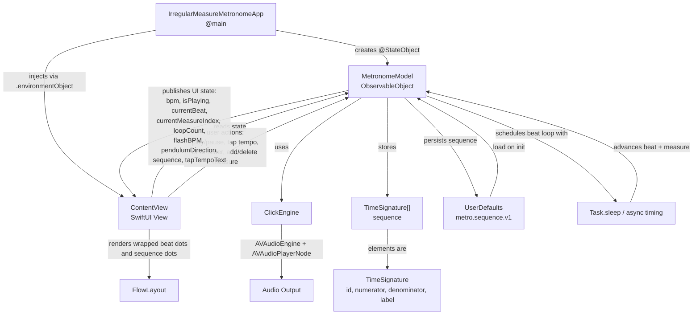

# Irregular Measure Metronome Architecture

## Participant Links

- [MetronomeModel](./participants/metronomemodel.md)
- [ContentView](./participants/contentview.md)
- [ClickEngine](./participants/clickengine.md)
- [UserDefaults](./participants/userdefaults.md)
- [Task.sleep](./participants/tasksleep.md)

## Notes

- Use the participant links above for reliable navigation. Some Markdown previews disable clickable Mermaid nodes.
- `IrregularMeasureMetronomeApp` creates a single shared `MetronomeModel` and injects it into the SwiftUI environment.
- `ContentView` is the only UI surface in this project and drives all user interaction, including playback controls, tap tempo, measure editing, and beat visualization.
- `MetronomeModel` owns playback state, timing, tap tempo, sequence management, and persistence.
- `ClickEngine` is isolated to audio generation and playback.
- `FlowLayout` wraps the main beat dots and the compact sequence dots.
