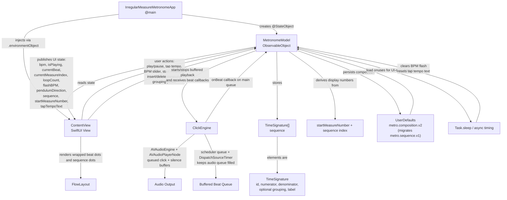

# Irregular Measure Metronome Architecture

## Participant Links

- [MetronomeModel](./participants/metronomemodel.md)
- [ContentView](./participants/contentview.md)
- [ClickEngine](./participants/clickengine.md)
- [UserDefaults](./participants/userdefaults.md)
- [Task.sleep](./participants/tasksleep.md)
- [Audio Scheduling](./AUDIO_SCHEDULING.md)

## Notes

- Use the participant links above for reliable navigation. Some Markdown previews disable clickable Mermaid nodes.
- `IrregularMeasureMetronomeApp` creates a single shared `MetronomeModel` and injects it into the SwiftUI environment.
- `ContentView` is the only UI surface in this project and drives all user interaction, including playback controls, tap tempo, start measure number, measure editing, grouping selection, and beat visualization.
- `MetronomeModel` owns published playback state, playback lifecycle, tap tempo, sequence management, grouping validation, consecutive measure numbering, persistence, and stale-callback filtering.
- `ClickEngine` owns accented, subaccented, and regular audio generation, buffered beat scheduling, silence-buffer caching, and audio-to-model beat callbacks.
- `Task.sleep` is not the beat-loop scheduler; it handles short UI delays for BPM flashing and tap-tempo reset.
- `FlowLayout` wraps the main beat dots and the compact sequence dots.
