# User Action Sequence Diagram

## Participants

- [User](participants/user.md)
- [ContentView](participants/contentview.md)
- [MetronomeModel](participants/metronomemodel.md)
- [ClickEngine](participants/clickengine.md)
- [UserDefaults](participants/userdefaults.md)
- [Task.sleep](participants/tasksleep.md)
- [ClickEngine scheduler queue](AUDIO_SCHEDULING.md)

```mermaid
sequenceDiagram
    actor User
    participant View as ContentView
    participant Model as MetronomeModel
    participant Engine as ClickEngine
    participant Defaults as UserDefaults
    participant Timer as Task.sleep
    participant Queue as ClickEngine scheduler queue

    rect rgb(35, 35, 40)
        Note over User,Timer: Play
        User->>View: Tap play button
        View->>Model: togglePlayback()
        Model->>Model: start()
        Model->>Model: reset currentBeat, currentMeasureIndex, loopCount
        Model->>Model: increment playbackGeneration
        Model->>Engine: start(bpm, sequence, position, onBeat)
        Engine->>Engine: prepare audio engine, player, and accented/subaccented/regular click buffers
        Engine->>Queue: stop previous scheduler and create generation
        Queue->>Queue: fill buffered queue up to maxQueuedBeats
        Queue->>Engine: schedule click buffer and silence buffer per beat
        Queue->>Queue: refill every 100 ms while generation is current
        Engine-->>Model: onBeat(measureIndex, beat, loopCount)
        Model->>Model: ignore stale callback if generation changed
        Model->>Model: publish currentMeasureIndex/currentBeat/loopCount
        Model->>Model: flash()
        Model->>Timer: sleep(80 ms)
        Timer-->>Model: clear flashBPM
        Model-->>View: publish playback state
    end

    rect rgb(35, 35, 40)
        Note over User,Timer: Pause
        User->>View: Tap pause button
        View->>Model: togglePlayback()
        Model->>Model: stop()
        Model->>Model: increment playbackGeneration
        Model->>Engine: stop()
        Engine->>Queue: cancel scheduler and stop player
        Model->>Timer: cancel flashTask
        Model->>Model: reset currentBeat and pendulumDirection
        Model-->>View: publish stopped state
    end

    rect rgb(35, 35, 40)
        Note over User,Timer: Change BPM
        User->>View: Drag BPM slider
        View->>Model: bpm = rounded slider value
        Model->>Model: clamp bpm to 20...300
        alt Playback is running
            Model->>Model: restartPlaybackFromCurrentPosition()
            Model->>Model: increment playbackGeneration
            Model->>Engine: start(bpm, sequence, current position, onBeat)
            Engine->>Queue: replace buffered scheduler generation
            Queue->>Queue: schedule future beats with updated interval
        else Playback is stopped
            Model-->>View: publish bpm and tempoName
        end
    end

    rect rgb(35, 35, 40)
        Note over User,Timer: Tap Tempo
        User->>View: Tap TEMPO button
        View->>Model: tapTempo()
        Model->>Model: append tap timestamp
        Model->>Timer: cancel previous tap reset
        Model->>Timer: sleep(2500 ms)
        alt Fewer than 2 taps
            Model-->>View: keep tapTempoText as TAP
        else 2 or more taps
            Model->>Model: average tap intervals
            Model->>Model: bpm = clamped calculated tempo
            Model->>Model: tapTempoText = bpm
            alt Playback is running
                Model->>Model: restartPlaybackFromCurrentPosition()
                Model->>Engine: restart buffered scheduling at tapped tempo
            end
            Model-->>View: publish bpm and tapTempoText
        end
        Timer-->>Model: clear tapTimes and reset tapTempoText
        Model-->>View: publish reset tapTempoText
    end

    rect rgb(35, 35, 40)
        Note over User,Defaults: Change First Measure Number
        User->>View: Adjust first measure stepper
        View->>Model: startMeasureNumber = new value
        Model->>Model: clamp startMeasureNumber to 0...9999
        Model->>Defaults: save encoded composition
        Model-->>View: publish consecutive displayed measure numbers
    end

    rect rgb(35, 35, 40)
        Note over User,Defaults: Duplicate Local Measure and Edit Inline
        User->>View: Tap insert button at a sequence boundary
        View->>Model: duplicateMeasure(at)
        Model->>Model: copy first measure when inserting before row 1
        Model->>Model: otherwise copy previous measure and grouping
        Model->>Defaults: save encoded composition
        Model->>Model: derive consecutive measure numbers from startMeasureNumber
        alt Playback is running
            Model->>Model: stop()
            Model->>Engine: stop buffered scheduling
            Model->>Timer: cancel flashTask
        end
        Model-->>View: publish updated sequence
        View->>View: open inline editor for inserted measure
        User->>View: Edit numerator or denominator in the row
        View->>View: validate numerator 1...24 and denominator 1...64
        alt Inputs are invalid
            View->>View: mark invalid inline fields
        else Inputs are valid
            View->>Model: updateMeasure(measure, numerator, denominator)
            Model->>Model: update TimeSignature and clean invalid grouping
            Model->>Defaults: save encoded composition
            alt Playback is running
                Model->>Model: stop()
                Model->>Engine: stop buffered scheduling
                Model->>Timer: cancel flashTask
            end
            Model-->>View: publish updated sequence
        end
    end

    rect rgb(35, 35, 40)
        Note over User,Defaults: Change Measure Grouping
        User->>View: Open grouping picker on a sequence row
        User->>View: Choose None or a grouping preset
        View->>Model: updateGrouping(for, grouping)
        Model->>Model: validate grouping sums to numerator
        Model->>Defaults: save encoded composition
        alt Playback is running
            Model->>Model: stop()
            Model->>Engine: stop buffered scheduling
            Model->>Timer: cancel flashTask
        end
        Model-->>View: publish updated sequence and grouping label
    end

    rect rgb(35, 35, 40)
        Note over User,Defaults: Delete Measure
        User->>View: Tap delete button on a sequence row
        alt Only one measure remains
            View->>View: delete button is disabled
        else More than one measure remains
            View->>Model: deleteMeasure(measure)
            Model->>Model: remove matching TimeSignature
            Model->>Defaults: save encoded composition
            Model->>Model: derive consecutive measure numbers from startMeasureNumber
            alt Playback is running
                Model->>Model: stop()
                Model->>Engine: stop buffered scheduling
                Model->>Timer: cancel flashTask
            end
            Model-->>View: publish updated sequence
        end
    end
```

